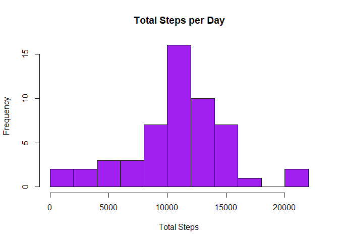
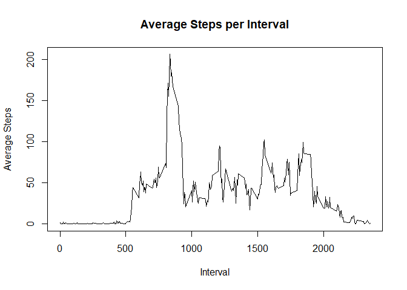
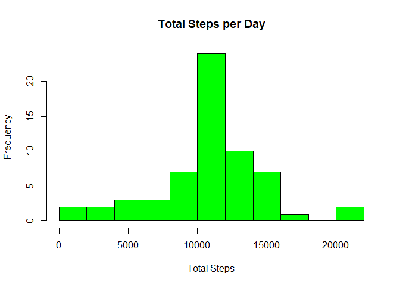
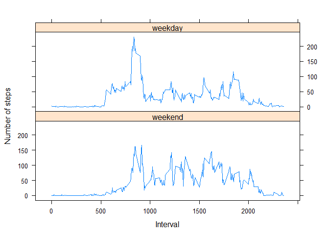

## Loading and Preprocessing Data

Reading in the data using the read.csv() function.


```r
actData <- read.csv("./repdata_data_activity/activity.csv")
```


## Mean total number of steps taken per day

First calculate the total number of steps per day.


```r
library(dplyr)
```

```
## 
## Attaching package: 'dplyr'
```

```
## The following objects are masked from 'package:stats':
## 
##     filter, lag
```

```
## The following objects are masked from 'package:base':
## 
##     intersect, setdiff, setequal, union
```

```r
byDay <- group_by(actData, actData$date)
totalSteps <- summarise(byDay, steps = sum(steps))
```

```
## `summarise()` ungrouping output (override with `.groups` argument)
```

Then create histogram of the total number of steps per day.


```r
hist(totalSteps$steps, main = "Total Steps per Day", xlab = "Total Steps", col = "purple", breaks = 10)
```

<!-- -->

Calculate the mean of the total number of steps per day.


```r
mean(totalSteps$steps, na.rm = TRUE)
```

```
## [1] 10766.19
```

Calculate the median of the total number of steps per day.


```r
median(totalSteps$steps, na.rm = TRUE)
```

```
## [1] 10765
```


## Average Daily Activity Plan

Find mean of steps per interval across all days.


```r
avgSteps <- aggregate(data = actData, steps~interval, mean, na.rm = TRUE)
```

Plot line graph of steps over the intervals.


```r
plot(avgSteps, type = "l", main = "Average Steps per Interval", xlab = "Interval", ylab = "Average Steps")
```

<!-- -->

Find interval with the maximum average number of steps.


```r
avgSteps$interval[which.max(avgSteps$steps)]
```

```
## [1] 835
```


## Imputing Missing Values

Find out how many rows have missing values.


```r
steps <- is.na(actData$steps)
sum(steps)
```

```
## [1] 2304
```

Fill in missing values with the mean for that interval.


```r
actData2 <- actData
for(i in 1:nrow(actData)){
    if(steps[i]){
        int <- actData$interval[i]
        num <- avgSteps$steps[avgSteps$interval == int]
        actData2$steps[i] <- num
    }
}
```

Calculate total number of steps with imputed data set.


```r
byDay2 <- group_by(actData2, actData2$date)
totalSteps2 <- summarise(byDay2, steps = sum(steps))
```

```
## `summarise()` ungrouping output (override with `.groups` argument)
```

Make histogram of data.


```r
hist(totalSteps2$steps, main = "Total Steps per Day", xlab = "Total Steps", col = "green", breaks = 10)
```

<!-- -->

Calculate the mean of the total number of steps per day.


```r
mean(totalSteps2$steps)
```

```
## [1] 10766.19
```

Calculate the median of the total number of steps per day.


```r
median(totalSteps2$steps)
```

```
## [1] 10766.19
```

There was not much change with the mean and the median total number of steps.


## Activity patterns for weekends and weekdays

Label weekends and weekdays accordingly using a factor variable.


```r
dayEnd <- actData2
dayEnd$days <- weekdays(as.Date(dayEnd$date))
dayEnd$week <- factor(dayEnd$days, levels = c("Saturday", "Sunday", "Monday", "Tuesday", "Wednesday", "Thursday", "Friday"), labels = c("weekend", "weekend", "weekday", "weekday", "weekday", "weekday", "weekday"))
```

Calculate means of each interval for both weekends and weekdays.


```r
groupedDayEnd <- group_by(dayEnd, dayEnd$interval, dayEnd$week)
avgDayEnd <- summarise(groupedDayEnd, steps = mean(steps))
```

```
## `summarise()` regrouping output by 'dayEnd$interval' (override with `.groups` argument)
```

Make a times series panel plot.


```r
library(lattice)
xyplot(data = avgDayEnd, steps ~ `dayEnd$interval` | `dayEnd$week`, layout = c(1, 2), type = "l", xlab = "Interval", ylab = "Number of steps")
```

<!-- -->
